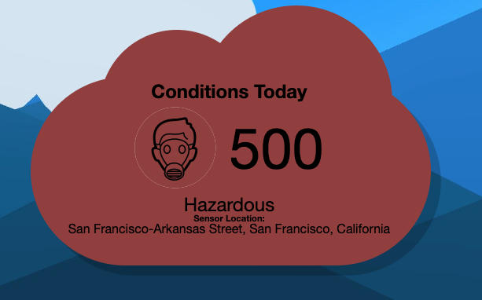
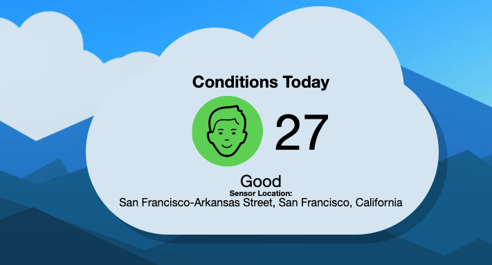

**San Francisco Air Quality Index**

[Live Site](https://cowfish813.github.io/D3.js/)

With the recent wildfires and other contributing factors to global warming, I found myself spending a lot more time on places like Purpleair.com. 
I built this app with a curiosity on how our changing climate is affecting how we live in the bay area and California as a whole and to have a webpage run necessary information to me that would not tax a slow computer's CPU.

These events are not normal and I wanted to visualize it over the years as well as track live readings of San Francisco's AQI as provided by https://aqicn.org and their sensors across the city. Each Sensor has a different API endpoint that are utilized with a secret token as follows.
```
`https://api.waqi.info/feed/${Sensor Location}`/?token={Unique Token ID}
```

The functional components involved with making the live update are utilized as follows
```
const widget = () => (fetch(`https://api.waqi.info/feed/${sensorSite}/?token=${token}`)
  .then(res => (res.json()))
  .then(res => {
    if (res) {
      for (let key in res) {
        data[key] = res[key];
      };
      const aqi = data.data.aqi;
      let status = "";
      let color = "";
      let png = ""
      if (aqi > 300) {
          status = "Hazardous";
          color ="brown";
          png = "6"
        } else if (aqi > 200) {
          status = "Very Unhealthy";
          color ="puple";
          png = "5"
        } else if (aqi > 151) {
          status = "Unhealthy";
          color = "red";
          png = "4"
        } else if (aqi > 100) {
          status = "USG";
          color = "orange";
          png = "3"
        } else if (aqi > 50) {
          status = "Moderate";
          color = "yellow";
          png = "2"
        } else {
          status = "Good";
          color = "greenyellow";
          png = "1"
        };
        //assembles widget without jank or preloaded elements
            //appends HTML elements to the DOM for efficient loading
        img.src =`./assets/aqi/${png}.png`;
        document.getElementById("aqi_widget").style.backgroundColor = color;
        document.getElementById("aqi_widget").style.border = "1px black solid";
        document.getElementById("title_conditions").innerHTML = "Conditions Today";
        document.getElementById("status").innerHTML = status;
        document.getElementById("aqi").innerHTML = aqi;
        document.getElementById("sensor_site").innerHTML = "Sensor Location:";
        document.getElementById("city").innerHTML = data.data.city.name;
        document.getElementById("widget_icon").appendChild(img);
    } else {
      console.log("API limit exhausted");
    };
  })
  .catch(err => {
    console.log(err);
  }));
```

"fetch" returns a promise that I can extract additonal data from including forecasts, current AQI and its associated information like ozone, PM2.5, PM10, bugs, and sensor location. I dynamically assembeled the functional widget entirely with CSS and promises.
The application is able to call this function every 5 minutes and update without having to reload the widget or entire webpage.

```
  const showLine = (e, selectedLine) => {
    const hoveredYear = selectedLine.year.trim();
    const pm25 = selectedLine.pm25;

    lines.attr("d", d => {
      if (hoveredYear === d.key) {
        labels.attr("x", 12)
          .text(d => { return (`Year: ${hoveredYear}`) })
          .style("font-size", 15)
          .attr('opacity', '1')
          .attr("transform",
            ("translate(" + x(selectedLine.date) + "," + y(selectedLine.pm25) + ")")
          );
        return line(d.values);
      }
      if (compare[d.key]) {
        return line(d.values); // from handleclick
      }
    })
    .attr("stroke", d => { return colors(d.key) })
  };
```


```
.cloud{ 
   width: 33.85rem;
   height: 15rem;
   box-shadow: .8rem .8rem rgba(0,0,0,0.2);
   border-radius: 9.25rem;
   margin: 8rem;
}
.cloud::after, .cloud::before {
    content: "";
    position: relative;
    display: inline-block;
    background: inherit;
    border-radius: inherit;
}
.cloud::after {
    width: 12.25rem;
    height: 12.25rem;
    top: -6.75rem;
  	right: 10rem;
}
.cloud::before {
    width: 15.25rem;
    height: 15.25rem;
    top: -5.7rem;
  	left: 13.5rem;
}
```
Shows how I was able to draw a cloud entirely from CSS and 1 div in HTML. The cloud carries another div that houses the content from the promises in "widget".




Future additions
    * AQI forecasts
    * Zooming in
